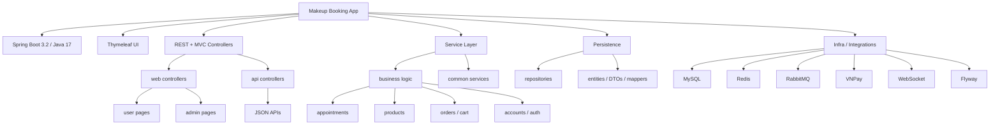

# Makeup Project Graph

Quick reading map for the repository. Keep this file short and structural so agents can orient fast.

## What matters first

- Entry point: [src/main/java/com/example/Makeup/MakeupApplication.java](src/main/java/com/example/Makeup/MakeupApplication.java)
- Web layer: `controller/web/**` for Thymeleaf pages, `controller/api/**` for JSON endpoints.
- Business layer: `service/**` and `service/impl/**`.
- Data layer: `repository/**`, `entity/**`, `mapper/**`, `dto/**`.
- Config and infra: `config/**`, `security/**`, `schedule/**`, `listener/**`, `processor/**`.

## Domain Map

- Core user flow: account -> product -> cart -> order -> payment.
- Booking flow: appointment -> staff scheduling -> admin review.
- Catalog flow: category -> subcategory -> product -> feedback.
- Cosplay and makeup landing pages are split into separate Thymeleaf layouts.

## Environment Notes

- Shared config lives in `application.properties`.
- Profiles: `local`, `dev`, `prod`.
- Required env vars: `MYSQL_USERNAME`, `MYSQL_PASSWORD`, `JWT_SECRET`, `OPENAI_API_KEY`, `MAIL_USERNAME`, `MAIL_PASSWORD`.
- Runtime dependencies: MySQL, Redis, RabbitMQ.

## Reading Order

1. Start with `MakeupApplication` and `SecurityConfiguration`.
2. Read one controller, then its service, then repository/entity chain.
3. Check `templates/**` for page behavior and `static/**` for UI assets.
4. Use Flyway migrations to confirm table shape before changing persistence code.

## Notes For Agents

- Prefer the existing module boundaries; do not merge MVC and API concerns.
- Keep admin page changes inside the current admin shell unless the request explicitly wants a new page.
- If you need a cached path or async flow, check `service/common/**`, `listener/**`, and `processor/**` first.
- Update this file whenever you make a meaningful repo change so the reading map stays current.

## Recent Changes

- Added grouped API rate limiting buckets in `ApiRateLimitFilter` to reduce Redis key explosion.
- Added appointment booking queue support with RabbitMQ plus fallback direct processing when the broker is unavailable.
- Added appointment index migration for staff/date/status and user/date lookups.
- Added booking token support for idempotent appointment creation and replay safety.
- Activated OpenAI chat API with base system prompt context loaded from `AI-knowledge.txt`.
- Added public `/api/chat/**` access and grouped `chat:general` rate limiting to control token usage.
- Added floating chat widget UI in both `layoutMakeup.html` and `layoutCosplay.html` using `/api/chat/send`.
- Added `spring.config.import` to auto-load local `secrets.env` so OpenAI and other secret configs are available at runtime.